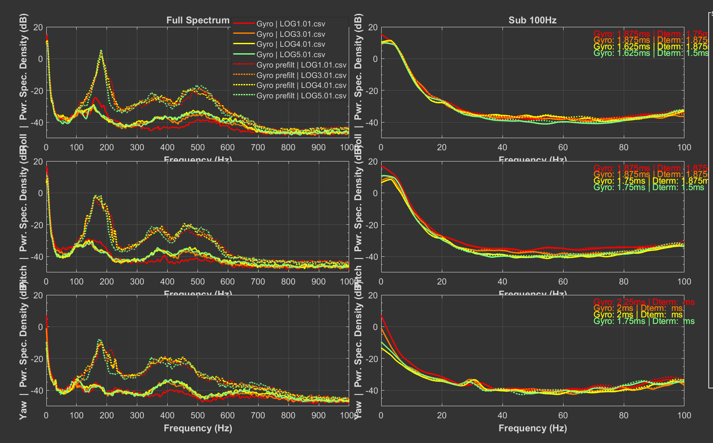
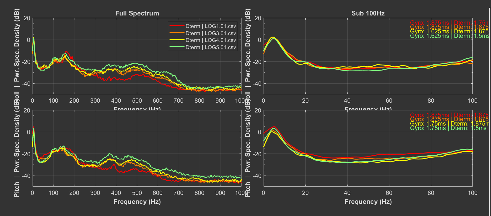
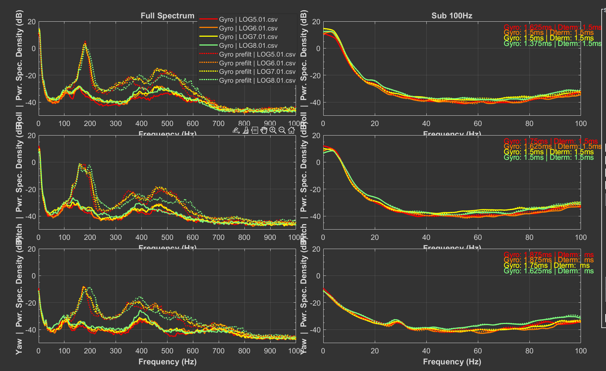
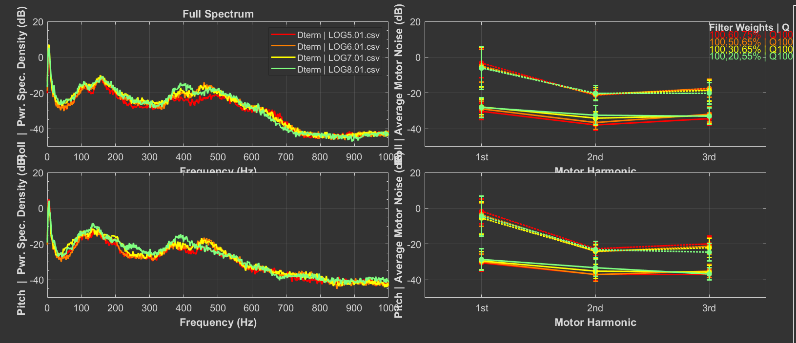
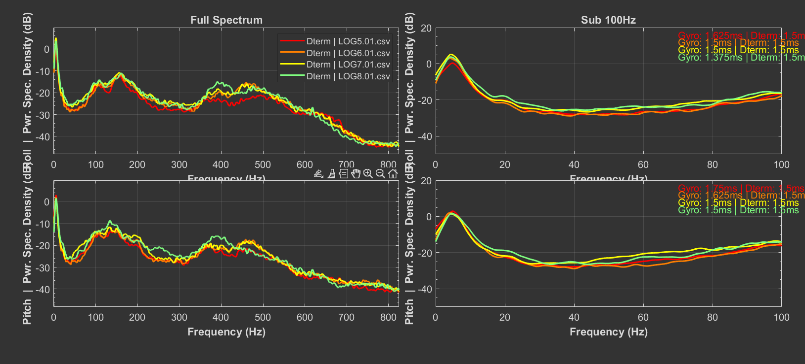
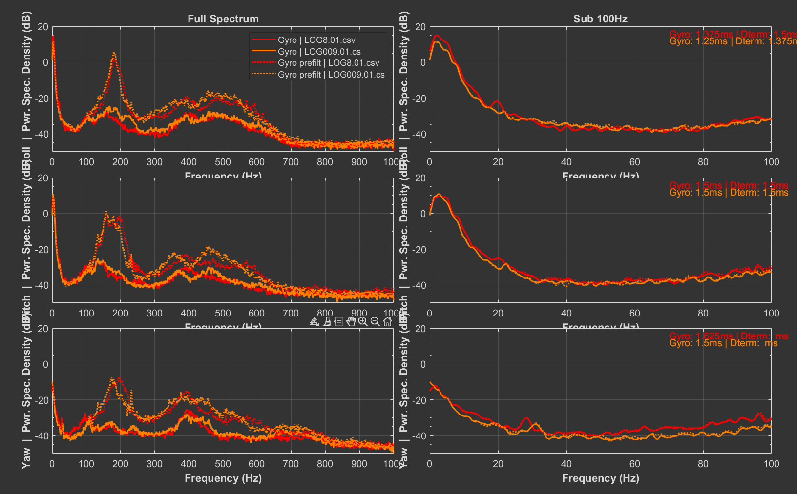
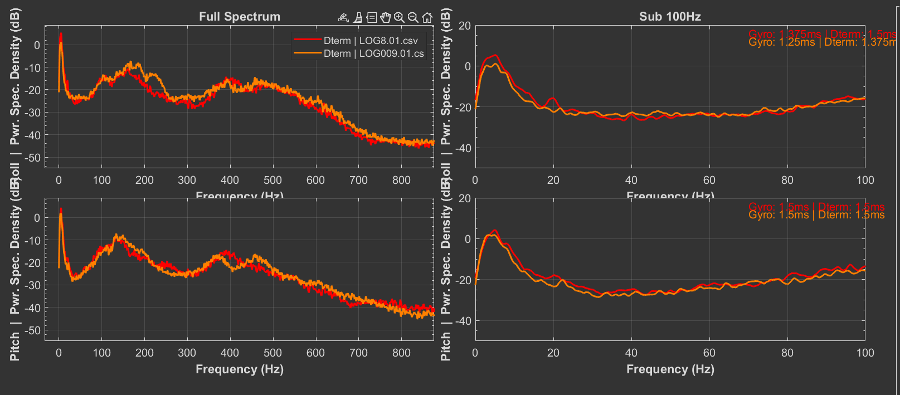

# Projekt: Filtrowanie i Strojenie PID drona FPV 5 cali (Betaflight 4.6, PIDToolbox)

## Opis Repozytorium

Niniejsze repozytorium stanowi techniczną dokumentację procesu strojenia 5-calowego drona FPV. Przedstawiona metodologia i analiza danych bazuje głównie na materiałach edukacyjnych oraz oprogramowaniu **PID toolbox, prowadzonych przez Briana White'a**. Repozytorium zawiera zbiór materiałów, logów i zrzutów konfiguracji, które krok po kroku przedstawiają proces optymalizacji ustawień w oprogramowaniu Betaflight 4.6

## Cele Tuningu

Głównym celem przeprowadzonych prac było osiągnięcie następujących rezultatów poprzez precyzyjne strojenie filtrów i pętli PID:

*   Poprawa responsywności i precyzji sterowania.
*   Maksymalna eliminacja zjawiska **propwash** 

### Kryteria techniczne:

#### Filtracja:
*  Redukcja szumów częstotliwościowych do poziomu poniżej **-10dB** na wykresie spektralnym.
*  Gyro delay w okolicach **1.5ms**.
  
Należy pamiętać, że powyższe wartości są orientacyjne. Kluczowe jest znalezienie balansu, ponieważ zbyt agresywne filtrowanie wprowadza opóźnienia , natomiast zbyt słabe może prowadzić do przegrzewania się silników.

#### PID tuning:

## Specyfikacja

*   **Rama:** Mark4 5" (225mm)
*   **Kontroler Lotu (FC):** YSIDO F4 V3S PLUS
*   **Regulatory (ESC):** YSIDO  45A 4-in-1 (wgrane Bluejay)
*   **Silniki:** YSIDO 2205 2300KV
*   **Śmigła:** iFlight Nazgul F5 (5140) 3-łopatowe
*   **Akumulator:** CNHL 4S 1500mAh 100C

## Rodzaje Lotów testowych 

Dane do analizy zbierałem przy użyciu dwóch kluczowych metod:
### 1. Podstawowy  Wobble Test

Procedura Wykonania Testu:
Wystartuj i ustabilizuj drona w zawisie (hover).
Uruchom skrypt Wobble Test na nadajniku.
Podczas gdy test jest aktywny (~30 sekund), płynnie i powoli zmieniaj położenie przepustnicy (throttle).
Reguluj przepustnicę w takim zakresie, aby dron wznosił się i opadał o około 2-3 metry. Celem jest zapisanie w czarnej skrzynce danych z całego zakresu pracy silników.

#### Konfiuracja 
Metoda ta  polega na wygenerowaniu przez nadajnik ciągłych, sinusoidalnych ruchów w osiach Roll i Pitch.

żródło:

https://www.youtube.com/watch?v=NczSDkKn9pY&ab_channel=PIDtoolbox

Nalezy użyć wraz z trybem angle mode o okreśnych paramterach:

### 2. Lot Weryfikacyjny 

1.  Wykonaj standardowy, swobodny lot w trybie Acro, unikając gwałtownych manewrów.
2.  Po wylądowaniu **natychmiast sprawdź temperaturę silników**. Powinny być co najwyżej lekko ciepłe.
    *   **Uwaga:** Jeśli silniki są gorące, nie przechodź do kolejnego etapu. Oznacza to problem ze zbut niskim filtrowaniem, który należy rozwiązać w pierwszej kolejności.

#### 3. Lot Full Throttle 

1.  Wykonaj **2-3 pełne przyspieszenia** , utrzymując przepustnicę wysokim poziomie przez kilka sekund.
2.  Podczas lotu na wysokiej przepustnicy wykonaj **serię szybkich obrotów**  w każdej osi:

## Proces Optymalizacji filtracji

| Krok | Wprowadzona Zmiana | Log Wynikowy | Roll (Gyro / Dterm ms) | Pitch (Gyro / Dterm ms) | Yaw (Gyro / Dterm ms) |
| :--: | :--- | :---: | :---: | :---: | :---: |
| 0 | **Wartości domyślne** | **Log 1** | 1.875 / 1.875 | 1.875 / 1.875 | 2.25 / 2.0 |
| 1 | `rpm_filter_weights = 100, 60, 75` | **Log 3** | 1.875 / 1.875 | 1.75 / 1.875 | 2.0 / 1.875 |
| 2 | `rpm_filter_q = 1000`, `q_factor = 300`, `notch_count = 3` | **Log 4** | 1.625 / 1.5 | 1.75 / 1.5 | 1.875 / 1.75 |
| 3 | `gyro_filter_multiplier = 2` | **Log 5** | 1.625 / 1.5 | 1.625 / 1.5 | 1.875 / 1.625 |
| 4 | `dterm_filter_multiplier = 1.3` | **Log 6** | 1.625 / 1.5 | 1.625 / 1.5 | 1.875 / 1.625 |
| 5 | `rpm_filter_weights = 100, 50, 65` | **Log 7** | 1.625 / 1.5 | 1.625 / 1.5 | 1.875 / 1.625 |
| 6 | `rpm_filter_weights = 100, 30, 75` | **Log 8** | 1.625 / 1.5 | 1.5 / 1.5 | 1.625 / 1.625 |
| 7 | `rpm_filter_weights = 100, 20, 55` | **Log 9** | 1.25 / 1.375 | 1.5 / 1.5 | 1.625 / 1.625 |
| 8 | `dynamic_notch_q = 350` | *(Brak)* | - | - | - |

#### Podsumowanie
*  Proces optymalizacji został zatrzymany po kroku 8. , **analiza  log009 wykazała, że szum na osi `dterm`  przekraczał docelowy poziom -10dB**.

*  Temperatura silników po locach testowych była akceptowalna (silniki były lekko ciepłe, ale nie gorące), co sugeruje, że ogólna filtracja jest bliska optymalnej, ale wymaga dalszej, precyzyjnej korekty.

##### Logi 1-5: 

---

##### Logi 5-8: zmniejszanie 'rpm_filter_weights'

---

##### Logi 8-9: zmniejszenie 'Notch q_factor'

